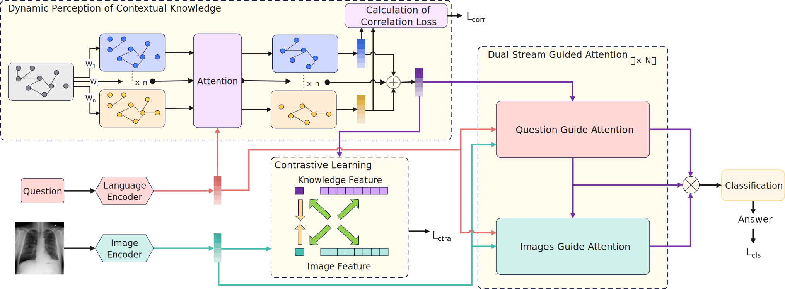

# CKRA-MedVQA

This is the implementation of Beyond Static Knowledge: Dynamic Context-Aware Cross-Modal Contrastive Learning for Medical Visual Question Answering.

## Abstract



## Requirements
Run the following command to install the required packages:
```bash
conda env create -f environment.yaml # method 1
pip install -r requirements.txt # method 2
```

## Preparation

```bash
├── checkpoints
├── data
│   ├── vqa_medvqa_2019_test.arrow
│   ├── ......
├── download
│   ├── checkpoints
│   ├── external_data
│   ├── pretrained
│   │   ├── m3ae.ckpt
│   ├── roberta-base
├── m3ae
├── prepro
├── run_scripts
```

### Dataset

Please follow [here](https://github.com/zhjohnchan/M3AE?tab=readme-ov-file#1-dataset-preparation-1) and only use the `SLAKE, VQA RAD, and MedVQA 2019 datasets`.

### External data

Download the [external_data](https://unisydneyedu-my.sharepoint.com/:f:/g/personal/tigu8498_uni_sydney_edu_au/Ev_GsFFY9BpKi-cOHSFIHecBRxYEB-9jjelVen4WUyyEGg?e=g3bbrC) and put it in the `download/external_data`.

### Pretrained

Download the [m3ae pretrained weight](https://drive.google.com/drive/folders/1b3_kiSHH8khOQaa7pPiX_ZQnUIBxeWWn) and put it in the `download/pretrained`.

### roberta-base

Download the [roberta-base](https://drive.google.com/drive/folders/1ouRx5ZAi98LuS6QyT3hHim9Uh7R1YY1H) and put it in the `download/roberta-base`.

### Checkpoints

Download the [checkpoints]([CKRA_checkpoints](https://1drv.ms/f/c/0ef3f7692d30fc19/En6cIAzp7r1Iseb-3y1vyw8BF-_NjnusZUB-Dp2nYI3ZGA?e=cd2pvp)) we trained and put it in the `download/checkpoints`.


## Train & Test

```bash
# cd this file 
bash run_scripts/ckra_train.sh
# cd this file
bash run_scripts/ckra_test.sh
```

## Citations
```angular2
@inproceedings{chen2022m3ae,
  title={Multi-Modal Masked Autoencoders for Medical Vision-and-Language Pre-Training},
  author={Chen, Zhihong and Du, Yuhao and Hu, Jinpeng and Liu, Yang and Li, Guanbin and Wan, Xiang and Chang, Tsung-Hui},
  booktitle={International Conference on Medical Image Computing and Computer-Assisted Intervention},
  year={2022},
  organization={Springer}
}
```
