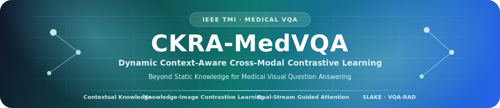
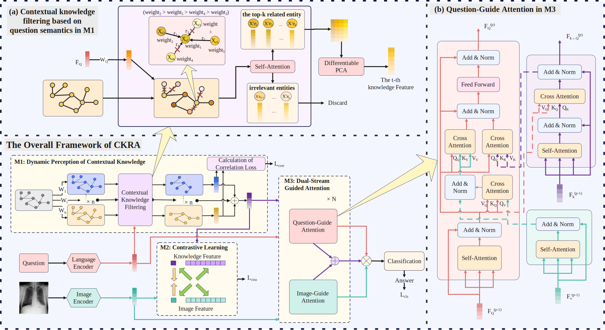

<p align="center">
  
</p>

<p align="center">
  <a href="https://github.com/cloneiq/CKRA-MedVQA/stargazers">
    
  </a>
  <a href="https://github.com/cloneiq/CKRA-MedVQA/commits/main">
    
  </a>
  <a href="https://github.com/cloneiq/CKRA-MedVQA">
    
  </a>
  <a href="#requirements">
    
  </a>
  <a href="#citations">
    
  </a>
</p>

<p align="center">
  <b>Official implementation of CKRA-MedVQA</b><br>
  Dynamic Context-Aware Knowledge Perception · Cross-Modal Contrastive Learning · Medical Visual Question Answering
</p>

# Overview

**CKRA-MedVQA** is the official implementation of:

> **Beyond Static Knowledge: Dynamic Context-Aware Cross-Modal Contrastive Learning for Medical Visual Question Answering**

This paper was published in **IEEE Transactions on Medical Imaging (IEEE TMI)**.

Medical Visual Question Answering (Med-VQA) aims to analyze medical images and accurately respond to natural language queries, thereby optimizing clinical workflows and improving diagnostic and therapeutic outcomes. Although medical images contain rich visual information, the corresponding textual queries frequently lack sufficient descriptive content. This imbalance of information and modality differences leads to significant semantic bias. Furthermore, existing approaches integrate external medical knowledge to enhance model performance, they primarily rely on static knowledge that lacks dynamic adaptation to specific input samples, leading to redundant information and noise interference.

To address these challenges, we propose a **Contextual Knowledge-Aware Dynamic Perception for the Cross-Modal Reasoning and Alignment (CKRA)** Model. To mitigate knowledge redundancy, CKRA employs a dynamic perception mechanism that leverages semantic cues from the query to selectively filter relevant medical knowledge specific to the current sample’s context. To alleviate cross-modal semantic bias, CKRA bridges the distance between visual and linguistic features through knowledge-image contrastive learning, optimizing knowledge feature representation and directing the model’s attention to key image regions. Further, we design a dual-stream guided attention network that facilitates cross-modal interaction and alignment across multiple dimensions. Experimental results show that the proposed CKRA model outperforms the state-of-the-art method on SLAKE and VQA-RAD datasets. In addition, ablation studies validate the effectiveness of each module, while Grad-CAM maps further demonstrate the feasibility of CKRA for medical visual questioning tasks. The overall architecture of the proposed method is depicted in the figure below.

<p align="center">
  
</p>

<p align="center">
  <sub>Overall architecture of CKRA-MedVQA.</sub>
</p>

The source code and weights of the model are available at:

<p align="center">
  <a href="https://github.com/cloneiq/CKRA-MedVQA">
    <b>https://github.com/cloneiq/CKRA-MedVQA</b>
  </a>
</p>

## Key Features

- **Joint training paradigm for dynamic knowledge-aware Med-VQA**: We propose a joint training framework that combines **dynamic context-aware knowledge perception** with **cross-modal contrastive learning**, enabling the model to select context-relevant medical knowledge guided by question semantics and visual cues.
- **Question- and image-guided knowledge reasoning**: CKRA uses contextual knowledge as shared support while allowing question semantics and image features to guide the model toward key visual regions, improving evidence-aware cross-modal reasoning.
- **Dual-Stream Guided Attention mechanism**: We design a dual-stream guided attention module in which questions and images collaboratively guide the inference process, facilitating multi-path reasoning across visual, textual, and knowledge modalities.

## Quick Start

### Clone the Repository

```bash
git clone https://github.com/cloneiq/CKRA-MedVQA.git
cd CKRA-MedVQA
```

### Install Requirements

```bash
conda env create -f environment.yaml
```

or

```bash
pip install -r requirements.txt
```

### Prepare Datasets and Pretrained Files

Prepare the datasets, pretrained weights, `roberta-base`, BioBERT, and checkpoints according to the instructions in [Preparation](#preparation).

### Train and Test

Run training and testing scripts as described in [Train & Test](#train--test).

## Project Structure

```bash
CKRA-MedVQA/
├── checkpoints/
├── data/
│   ├── vqa_medvqa_2019_test.arrow
│   ├── ......
├── download/
│   ├── checkpoints/
│   ├── biobert_v1.1/
│   ├── pretrained/
│   │   ├── m3ae.ckpt
│   ├── roberta-base/
├── m3ae/
├── prepro/
└── run_scripts/
```

## Requirements

Run the following command to install the required packages:

```bash
conda env create -f environment.yaml # method 1
pip install -r requirements.txt # method 2
```

## Preparation

### Dataset

Please follow [here](https://github.com/zhjohnchan/M3AE?tab=readme-ov-file#1-dataset-preparation-1) and only use the `SLAKE and VQA-RAD datasets`.

### Pretrained

Download the [m3ae pretrained weight](https://drive.google.com/drive/folders/1b3_kiSHH8khOQaa7pPiX_ZQnUIBxeWWn) and put it in the `download/pretrained`.

### roberta-base

Download the [roberta-base](https://drive.google.com/drive/folders/1ouRx5ZAi98LuS6QyT3hHim9Uh7R1YY1H) and put it in the `download/roberta-base`.

### BioBert

Download the [BioBert](https://huggingface.co/dmis-lab/biobert-v1.1/tree/main) and put it in the `download/biobert_v1.1`.

### Checkpoints

Download the [checkpoints](https://1drv.ms/f/c/0ef3f7692d30fc19/En6cIAzp7r1Iseb-3y1vyw8BF-_NjnusZUB-Dp2nYI3ZGA?e=DbGU3Y) we trained and put it in the `download/checkpoints`.

## Train & Test

```bash
# Train
bash run_scripts/ckra_train.sh
# Test
bash run_scripts/ckra_test.sh
```
## Citations

If this repository is useful for your research, please cite:

```bibtex
@article{Yang2025CKRA-MedVQA,
  title={Beyond Static Knowledge: Dynamic Context-Aware Cross-Modal Contrastive Learning for Medical Visual Question Answering},
  author={Rui Yang, Lijun Liu*,Xupeng Feng,Wei Peng, Xiaobing Yang},
  journal={IEEE Transactions on Medical Imaging},
  year={2025},
  publisher={IEEE}
}
```

```bibtex
@inproceedings{chen2022m3ae,
  title={Multi-Modal Masked Autoencoders for Medical Vision-and-Language Pre-Training},
  author={Chen, Zhihong and Du, Yuhao and Hu, Jinpeng and Liu, Yang and Li, Guanbin and Wan, Xiang and Chang, Tsung-Hui},
  booktitle={International Conference on Medical Image Computing and Computer-Assisted Intervention},
  year={2022},
  organization={Springer}
}
```

## Contact

**First Author**: Rui Yang, Kunming University of Science and Technology Kunming, Yunnan CHINA, email: r2125381663@163.com

**Corresponding Author**: Lijun Liu, Associate Professor (Ph.D.), Kunming University of Science and Technology Kunming, Yunnan CHINA, email: cloneiq@kust.edu.cn

## Acknowledges

We thank [M3AE](https://github.com/zhjohnchan/M3AE) for its open-source implementation and dataset preparation reference, and we also thank the SLAKE and VQA-RAD datasets for supporting reproducible evaluation in medical visual question answering. We further acknowledge BioBERT and `roberta-base` for providing useful language representation backbones for medical vision-language modeling.

<p align="center">
  <sub>Maintained for dynamic knowledge-aware and cross-modal reasoning research in Medical Visual Question Answering.</sub>
</p>
